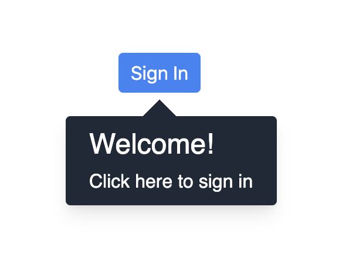

<div id="top"></div>

[![Contributors][contributors-shield]][contributors-url]
[![Forks][forks-shield]][forks-url]
[![Stargazers][stars-shield]][stars-url]
[![Issues][issues-shield]][issues-url]
[![MIT License][license-shield]][license-url]
[![LinkedIn][linkedin-shield]][linkedin-url]

<!-- PROJECT LOGO -->
<br />
<div align="center">

<div style="display: flex; flex-direction: column">
  <h2 text-align="center">Wanderer.js</h2>
  
  <p text-align="center">
    Simple, Beautiful onboarding.
  </p>
  <a href="https://wandererjs.com"><strong>Explore the docs »</strong></a>
</div>
</div>

### Built With

- [Vue.js](https://vuejs.org/)
- [Typescript](https://www.typescriptlang.org/)

<!-- GETTING STARTED -->

# Introduction

Wanderer.js is an easy to use, interactive product tour library. It allows you to create interactive product tours so that your users understand how to use your product quickly. It is still in its early stages so more work needs to be done, but at this stage it is still quite functional. Some features it already has include:

- Tooltips
- Theming
- Smart auto-positioning
- Multi-page support

Since Wanderer.js is still at such an early stage, the early adopters will have a lot of say in regards to which features they want in upcoming releases. Things that are already on the roadmap include:

- Modals - (For the introductory/final step of a Trip)
- Analytics integrations
- Tooltip WYSIWYG builder
- More themes
- User surveys

## Why does this exist

Based on my research, there are two types of solutions in this space. One option is geared more towards companies/enterprises like Appcues, Walkme, etc.) and the other options is small open source libraries like Intro.js or Shepherdjs.

When it comes to the commercial offerings, the price is way too steep for individual developers, or small companies just starting out. So while they are very feature rich, they're simply not an option. On the other hand, open source libraries are generally lacking core features and come out of the box looking quite ugly.

I intend on turning Wanderer.js into a hybrid of these two options. Creating a feature rich, user onboarding library (that's not just tooltips) that also looks nice right off the bat.

# Installation

The simplest way to get started with Wanderer.js is to install it using `npm`

```sh
npm i wanderer.js
```

And then in your codebase somewhere you can use it like this:

```js
import { Trip } from "wanderer.js";

const steps = [
  {
    progressOn: "ELEMENT",
    element: "#button",
    headerText: "Welcome!",
    bodyText: "Welcome to Wanderer.js",
  },
];

const theme = "WANDERER_DARK";

const trip = new Trip(steps, theme);

trip.start();
```

This will create a tooltip that looks something like this.

<div style="width: 100%; display: flex; justify-content: center;">
    
</div>
<br>
And when you click on the "Sign In" button, the trip will be finished (since there is only one step)
<br><br>

### Other installation methods

You can also use Wanderer.js by including it in your HTML file at the following URL
[https://unpkg.com/wanderer.js](https://unpkg.com/wanderer.js)

```html
<script src="https://unpkg.com/wanderer.js"></script>

<script>
    const trip = new Trip(steps, theme);
</script>

```

_For more complete documentation, please refer to the [Documentation](https://wandererjs.com)_

<br>

## License

Distributed under the MIT License. See `LICENSE.txt` for more information.

<!-- CONTACT -->

## Contact

Jacob Beckerman - [@JacobBeckerman](https://twitter.com/@JacobBeckerman)

Project Link: [https://github.com/yaakov123/wandererjs](https://github.com/yaakov123/wandererjs)

<!-- ACKNOWLEDGMENTS -->

[contributors-shield]: https://img.shields.io/github/contributors/yaakov123/wandererjs.svg?style=for-the-badge
[contributors-url]: https://github.com/yaakov123/wandererjs/graphs/contributors
[forks-shield]: https://img.shields.io/github/forks/yaakov123/wandererjs.svg?style=for-the-badge
[forks-url]: https://github.com/yaakov123/wandererjs/network/members
[stars-shield]: https://img.shields.io/github/stars/yaakov123/wandererjs.svg?style=for-the-badge
[stars-url]: https://github.com/yaakov123/wandererjs/stargazers
[issues-shield]: https://img.shields.io/github/issues/yaakov123/wandererjs.svg?style=for-the-badge
[issues-url]: https://github.com/yaakov123/wandererjs/issues
[license-shield]: https://img.shields.io/github/license/yaakov123/wandererjs.svg?style=for-the-badge
[license-url]: https://github.com/yaakov123/wandererjs/blob/master/LICENSE.txt
[linkedin-shield]: https://img.shields.io/badge/-LinkedIn-black.svg?style=for-the-badge&logo=linkedin&colorB=555
[linkedin-url]: https://linkedin.com/in/yaakov-beckerman-85722a141
[product-screenshot]: images/screenshot.png
